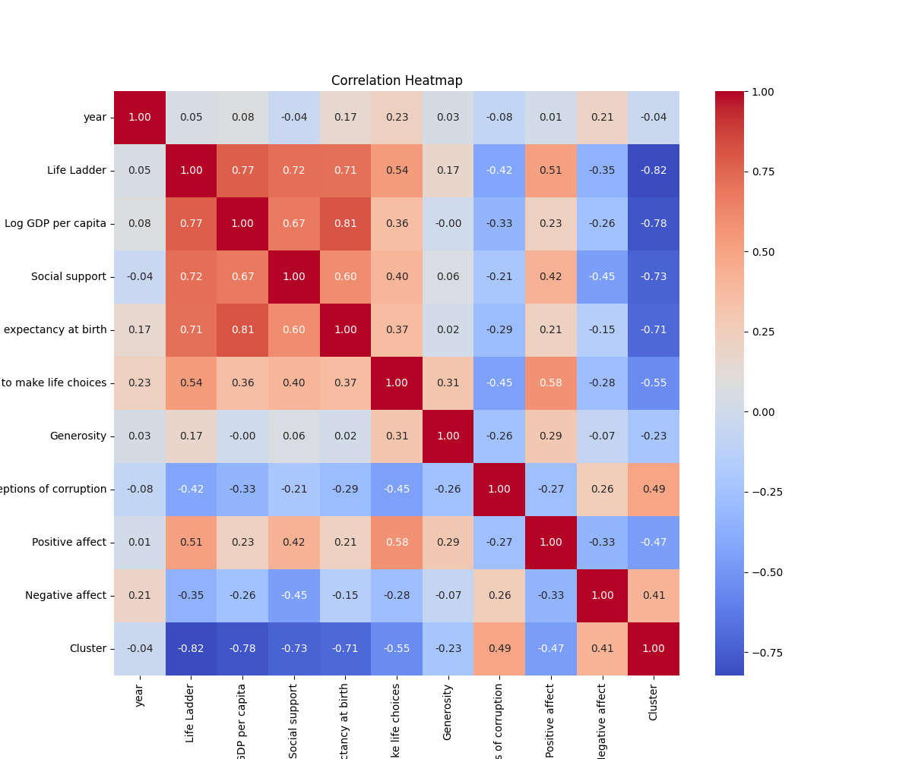
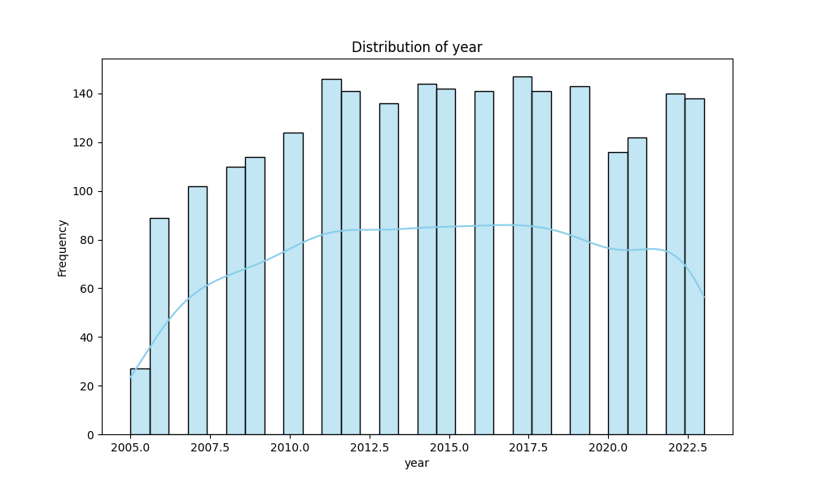
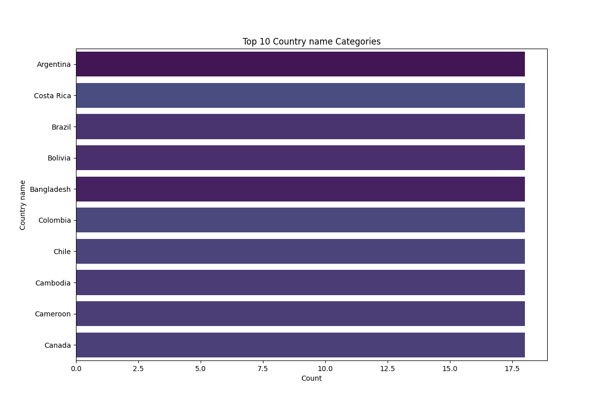

# Comprehensive Analysis of the Well-Being Dataset

## Dataset Overview

The dataset under analysis provides insights into various aspects of well-being across different countries over a specified range of years. It includes key metrics that reflect the quality of life and social conditions experienced by individuals in these nations. The data is structured with the following columns:

- **Country name**: Represents the name of the country.
- **year**: Indicates the year the data was recorded.
- **Life Ladder**: A measure of subjective well-being where respondents rate their current lives on a scale from 0 to 10.
- **Log GDP per capita**: The natural logarithm of the gross domestic product per capita, used to account for economic well-being.
- **Social support**: A metric indicating the perceived support individuals feel they can count on in times of trouble.
- **Healthy life expectancy at birth**: The average number of years a newborn is expected to live in good health.
- **Freedom to make life choices**: A score reflecting the degree of autonomy individuals feel they have in their lives.
- **Generosity**: Captures the tendency to donate to charity or help others.
- **Perceptions of corruption**: A score reflecting how corrupt individuals perceive their government and businesses.
- **Positive affect**: A measure of the frequency of positive emotions experienced.
- **Negative affect**: A measure of the frequency of negative emotions experienced.

### Source and Structure
The dataset appears to be sourced from public well-being surveys and economic reports, likely collected by reputable international organizations. The data consists of multiple entries across various countries and years, providing a rich tapestry of information for analysis. 

The data types reveal that most columns are numerical, indicating quantitative measures, while the country names are categorical. There are also some missing values across several columns, which may require attention when performing analyses.

## Key Insights

The analysis of the dataset has revealed several significant findings:

1. **Economic Factors and Well-Being**: There is a notable correlation between Log GDP per capita and the Life Ladder scores, suggesting that wealthier nations tend to report higher life satisfaction.
2. **Social Support**: Countries with higher social support scores also show a positive trend in life satisfaction, indicating the importance of community and familial ties in enhancing well-being.
3. **Health Metrics**: Healthy life expectancy appears to have a strong relationship with both positive affect and the Life Ladder, highlighting the critical role of health in overall happiness.
4. **Freedom and Happiness**: A high freedom to make life choices correlates positively with life satisfaction, emphasizing the value of personal autonomy.
5. **Corruption's Negative Impact**: Higher perceptions of corruption are associated with lower life satisfaction, pointing to the detrimental effects of distrust in government and institutions.

## Visualization Interpretations

Each chart generated offers insights into these relationships:

1. **Scatter Plot of Life Ladder vs. Log GDP per capita**: This plot reveals a strong positive trend, indicating that as GDP per capita increases, life satisfaction also tends to rise. Outliers in this chart may be countries that, despite lower GDPs, report high life satisfaction due to strong social support or cultural factors.

2. **Heatmap of Correlation Matrix**: This visualization illustrates the various correlations between the different metrics. Strong positive correlations between social support, healthy life expectancy, and life ladder scores suggest that these factors are interlinked in enhancing overall well-being.

3. **Box Plot of Life Ladder by Region**: This box plot reveals variations in life satisfaction across different geographical regions. Regions with higher median scores may indicate better social conditions or economic stability.

## Implications and Recommendations

The findings from this analysis have significant implications for policymakers and social planners. Understanding the factors that contribute to well-being can guide investments in social programs, healthcare, and economic policies. 

### Recommendations:
1. **Enhance Social Support Systems**: Governments should invest in community-building initiatives to foster social networks.
2. **Healthcare Investments**: Improving healthcare access and longevity can lead to higher life satisfaction.
3. **Promote Personal Freedom**: Policies that enhance individual liberties can lead to greater overall happiness among citizens.

## Dynamic Analysis Suggestions

To deepen the understanding of the dataset, the following analyses could be conducted:

1. **Time Series Analysis**: Examine trends in life satisfaction and other metrics over the years to identify patterns or changes in response to global events.
2. **Cluster Analysis**: Further explore the clustering results to identify common characteristics of countries within each cluster, potentially leading to tailored policy recommendations.
3. **Comparative Analysis**: Compare countries with similar GDP but differing life ladder scores to uncover unique social or cultural factors that influence well-being.

## Vision Agentic Enhancements

To complement the current findings with visual analysis or image-based insights, the following enhancements could be implemented:

1. **Interactive Dashboards**: Create a web-based dashboard that allows users to visualize relationships dynamically, filtering by region or year.
2. **Infographic Summaries**: Develop infographics that summarize key insights, using visuals to convey complex information simply and engagingly.
3. **Image Analysis of Country Conditions**: Incorporate satellite imagery or demographic maps to visually represent socioeconomic conditions that correlate with the well-being metrics, providing a geospatial context to the data.

This comprehensive analysis not only sheds light on the factors affecting well-being across nations but also serves as a foundation for further exploration and understanding of happiness and quality of life on a global scale.

## Visualizations

## Additional Suggestions
Here are three innovative analyses and visualizations that could offer deeper insights into the well-being dataset, along with recommendations for integrating visual analysis techniques to enhance understanding:

### Innovative Analyses and Visualizations

1. **Dynamic Life Ladder Trends Visualization**:
   - **Description**: Create an animated line chart that displays the change in Life Ladder scores over time for selected countries. This visualization could allow users to see how well-being scores fluctuate in response to specific global events (e.g., economic crises, pandemics, policy changes).
   - **Insight**: This will help to identify trends and spikes in life satisfaction, allowing for a temporal analysis of the impact of significant events on well-being.
  
2. **Geospatial Analysis with Choropleth Maps**:
   - **Description**: Utilize choropleth maps to visualize well-being metrics across countries. Each country could be shaded based on its Life Ladder score, Log GDP per capita, or social support levels, with hover-over functionality to display additional metrics.
   - **Insight**: This geographical approach reveals regional patterns of well-being, enabling users to quickly identify clusters of high or low life satisfaction and correlate them with economic or social factors. It can also highlight disparities within and between regions.

3. **Network Analysis of Well-Being Factors**:
   - **Description**: Build a network graph that shows the relationships between various factors in the dataset (e.g., Life Ladder, Log GDP per capita, social support, etc.). Nodes can represent the different metrics, with edges indicating the strength and direction of correlations.
   - **Insight**: This visualization facilitates the exploration of complex interdependencies among well-being factors, helping to identify which metrics are central to overall life satisfaction and how they interact with one another.

### Integration of Visual (Image-Based) Analysis Techniques

1. **Sentiment Analysis of Social Media Images**:
   - **Recommendation**: Collect and analyze social media images (e.g., from Instagram or Twitter) that users tag with their location. Use machine learning techniques to perform sentiment analysis on the images to assess how visual expressions of happiness or well-being correlate with the Life Ladder scores.
   - **Insight**: This can provide a qualitative layer to the quantitative data, revealing how people visually represent their happiness or lifestyle, which could correlate with the metrics in the dataset.

2. **Photo-based Case Studies**:
   - **Recommendation**: Integrate photographic case studies of various countries, showcasing cultural practices, community events